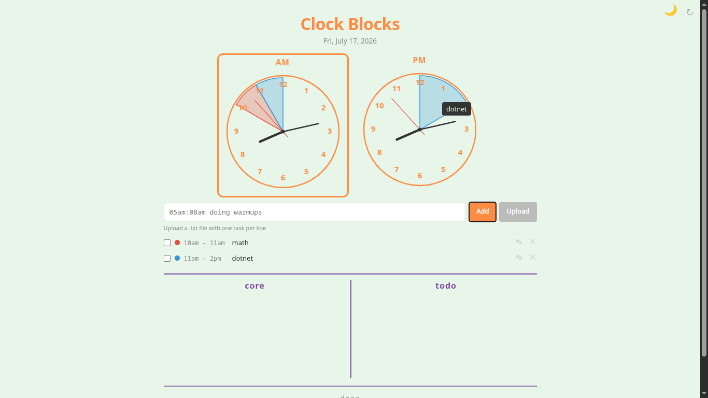
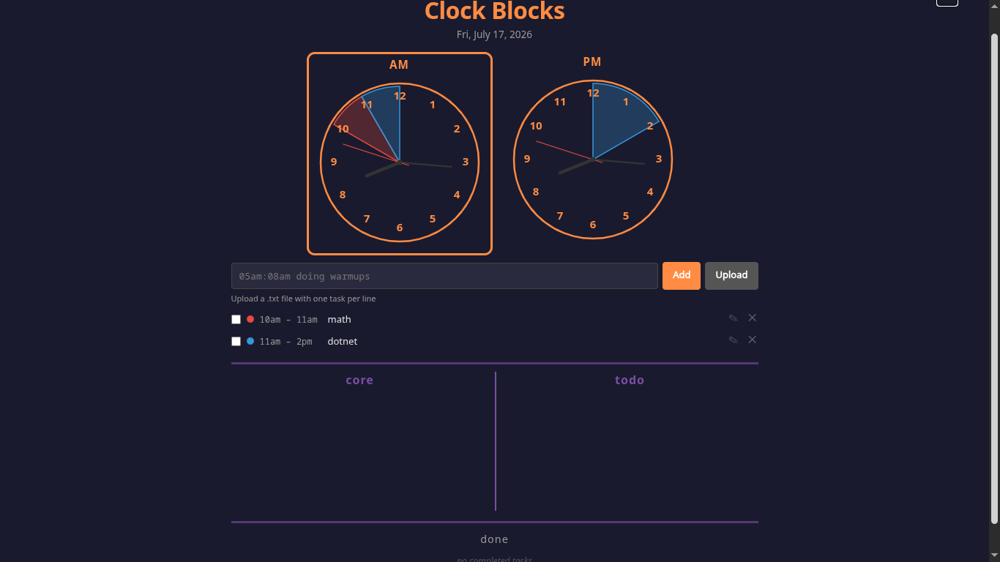

* Clock Blocks — Time Blocking Daily Planner

** Overview

A single-file HTML app for time-blocking productivity. Enter tasks in the
"05am:08am doing warmups" format and see them as colored arcs on live
analog clocks (AM + PM). Includes a core-priority checklist and a general
todo list. Tasks dragged to the core section turn red for visual priority.

** Screenshots

** Features

- Two live analog clocks (AM / PM) synced to system timezone
- All 12 hour numbers rendered on each clock face
- Active-period clock (AM or PM) highlighted with a square outline
- Color-coded time blocks rendered as arc sectors on the proper clock
- Tasks in the core section turn red to denote priority
- Hover any clock block to see a tooltip with the task name
- Task input via text box or bulk .txt file upload
- Core tasks section (3 priority tasks with checkboxes)
- Todo section (6 general tasks with checkboxes)
- Reset button (top right) to clear all data
- Dark mode toggle (top right) with persisted preference
- Auto-filled current date
- All data persists in browser localStorage
- Zero dependencies — open index.html in any browser

** Tech Stack

- Single file: index.html
- Vanilla HTML5 + CSS3 (Grid layout)
- Vanilla JavaScript (Canvas 2D API for clocks)
- localStorage for persistence
- No build tools, no frameworks, no npm

** How to Use

1. Open index.html in a browser.
2. Type a task in the format ~05am:08am doing warmups~ and click Add.
   Or upload a .txt file with one task per line (same format).
3. The colored block appears on the AM or PM clock immediately.
4. Hover any clock block to see the task name in a tooltip.
5. Drag a task into the Core section — its clock block turns red for priority.
6. Check off core tasks and todo items by clicking the circles.
7. Edit core/todo text by clicking on it.
8. Use the ↻ button (top-right) to reset all data.
9. Click the 🌙/☀️ button (top-right) to toggle dark mode.
10. All data saves automatically to localStorage.

** Task Format

~<start><am|pm>:<end><am|pm> <task description>~

Examples:
- ~05am:08am doing warmups~
- ~10am:12pm team standup~
- ~2pm:5pm deep work session~
- ~11pm:1am night coding~ (crosses midnight)

** File Structure

- index.html        — the entire app
- README.org        — this file
- plan-todos.org    — dev roadmap
- bugs.org          — known issues
- changelog.org     — version history
- screenshots/clock-blocks-light-theme.png — light theme screenshot
- screenshots/dark-theme.png              — dark theme screenshot
- screenshots/original-mock.png           — original design mock

** Color Palette

- Background: pastel mint green (#e8f5e9)
- Clocks & title: orange (#ff8c42)
- Section headers & dividers: purple (#7b4ea3)
- Task blocks: auto-assigned from a 10-color palette (core tasks always red)
